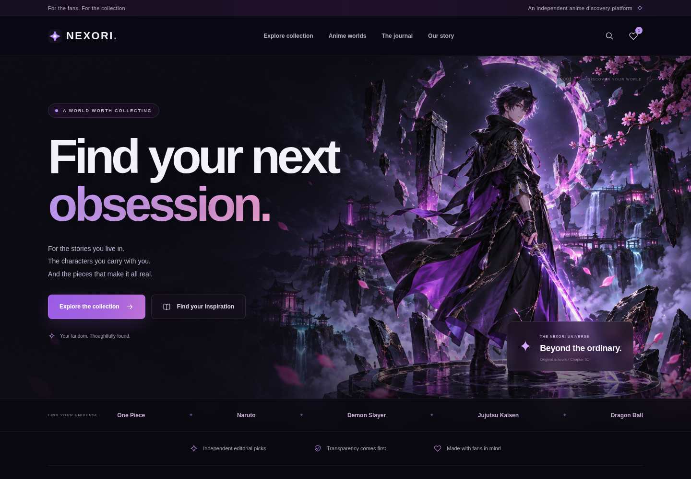

# NEXORI

A new, responsive anime discovery website, built from scratch with vanilla JavaScript and Vite. The site keeps the dark violet, pink, and cyan direction of the supplied visual reference.

## Visual preview

These screenshots show the running application. The repository stores source code; it is not a publicly hosted website.



[View the mobile screenshot](docs/mobile-preview.png)

The latest design adds an original cinematic anime banner in the dark violet/pink palette, glass accents, refined typography, interactive inspiration tabs, a **Surprise me** discovery button, and a dedicated desk-and-room inspiration feature. The banner is embedded in the standalone HTML, too.

The main headline is **Your Portal to Authentic Anime Culture & Collectibles**, with a slow, restrained neon color effect. Text throughout the site is larger; navigation and anime-world links use visible neon outlines. The original banner has a subtle breathing sword glow and three independently floating rocks. As you scroll, the banner continues down into the beginning of the content, with its lower edge fading into the background. A floating toolbar provides saved finds, surprise discovery, and back-to-top actions after scrolling. All decorative motion respects the browser's reduced-motion preference. [View the floating toolbar](docs/floating-tools-preview.png).

[View the banner animation](docs/banner-motion.gif) · [Desktop while scrolling](docs/banner-scroll-preview.png) · [Mobile while scrolling](docs/mobile-banner-scroll-preview.png)

## Open as a single HTML file

Download [NEXORI.html](NEXORI.html), then open the downloaded file in a modern browser. This self-contained version includes the CSS, JavaScript, and all original illustrations; no Node.js installation or server is required. Its navigation uses URL hashes so the collection, articles, filters, and saved finds work locally. Browser restrictions may make favorites temporary when opening local files.

GitHub's file page displays source code rather than running HTML. Use the file's **Download raw file** button and open it from your Downloads folder. The standalone file is regenerated by `npm run build:html` and `npm run build`.

## Manage content inside the website with Firebase

**Current owner constraint: free services only, Firebase Spark, no payment method or Cloud Billing.** See the [Spark-only plan](docs/firebase-spark-plan-he.md). The existing Functions/Storage editor is locally tested but needs adaptation before it can run on Spark. Do not follow its former Blaze deployment path or activate paid services. Firestore Standard with Production-mode initial rules can be created on Spark within its no-cost quotas; Production mode is not a billing plan.

The main Vite application now includes an **Owner sign-in** link in the footer and a Hebrew `/admin` page. Connect your own Firebase project to enable verified owner sign-in, inline editing for the existing cards, cross-device draft storage, image uploads, applying saved changes and revision recovery. All six anime worlds have independent card and inner-page titles/backgrounds. The existing design and marked concepts remain intact.

The repository has no live Firebase project configuration or manager credentials. Without Firebase settings the website works with original content and the admin page explains the missing connection; it does not claim to save remotely. See the [step-by-step Firebase Console guide in Hebrew](docs/firebase-console-setup-he.md). Firebase Web configuration goes in `.env.local` using `.env.example`; never commit a service-account key. This configuration uses Cloud Functions and Cloud Storage and requires reviewing Blaze billing before cloud setup. No hosting or live infrastructure was deployed.

Drafts and images are private to a verified UID with `admins/{uid}.active == true`. Firestore and Storage rules deny direct content writes and self-granted roles. Callable functions check ownership, validate content, detect stale revisions and strip private product notes/preparation links before publishing. Images are decoded on the server and released publicly only after the content transaction succeeds. The editor uses session-based authentication and does not keep cloud manager drafts in browser localStorage. Cloud rules and IAM/CORS must be verified on the actual development project before launch.

```sh
npm ci
npm ci --prefix functions
npm run firebase:sync
npm run test:catalog
npm run test:content
npm run test:firebase-validation
FIREBASE_EMULATORS_PATH=/tmp/nexori-firebase-emulators npm run test:firebase
```

Java 21+ is needed for the local emulators, which use only `demo-nexori`. The schema in `functions/shared` is generated from `src` by `firebase:sync`; the deploy hook synchronizes it too. Emulator integration tests require an official download from `storage.googleapis.com`. All four emulator tests passed locally. In this proxy-based cloud environment use the loopback preload and writable cache/config paths documented in [validation status and limits](docs/firebase-editor-checks.md). Real Firebase project permissions remain unverified.

The old **[NEXORI-editor.html](NEXORI-editor.html)** remains available as an optional local backup workflow. Its changes stay in the browser and exported HTML; it does not use Firebase. The standalone visitor HTML is also an offline preview, rather than the new hosted management application. Daily Firebase edits do not need HTML downloads or GitHub commits. Creating additional product records and activating verified affiliate links remain later work.

## Develop

Requires Node.js 22.12+ for the complete Firebase tooling workflow (validated locally with Node.js 24); Functions deploy on Node.js 22. Vite alone supports Node.js 20.19+ or 22.12+.

```sh
cd /workspace/nexori
npm ci
npm run dev -- --port 5173 --strictPort
```

## Production build

```sh
npm run build
npm run preview -- --port 4173 --strictPort
```

Deploy `dist/` to a static host configured to serve `index.html` for application routes such as `/collection`, `/product/midnight-ronin`, and `/guides/first-figure`. The hosting platform must also handle genuine HTTP 404s appropriately; the app supplies a not-found view for unknown paths.

## What works

- Responsive home, collection, concept details, anime worlds, journal articles, saved finds, and information pages.
- Local collection search, category filtering, alphabetical sorting, and browser history.
- Accessible search dialog and mobile navigation.
- Favorites stored locally in the browser; no account or server required.
- Local artwork, including an original generated cinematic PNG banner and SVG concept illustrations, with no external image or font dependencies.
- Homepage inspiration tabs and random concept discovery through **Surprise me**.

## Catalog structure and adding products later

The catalog now has five primary categories: **Figures & collectibles**, **Apparel & style**, **Desk & room**, **Replicas & props**, and **Accessories & small finds**. Each has explicit product types. Anime worlds are a separate classification; category, world, type, search and sort can be combined in shareable URLs and restored on refresh/history navigation. World pages link to their categories rather than a dead-end placeholder. Original concepts remain separate from franchise merchandise.

Use the [Hebrew product-placement guide](docs/product-placement-guide-he.md) for the full click map and classification rules, and the [product intake CSV](docs/product-intake-template.csv) to record future choices. The CSV contains planning slots, not actual products; it is not an automatic import or administration interface. Each item should have one record with a primary category, product type and world. Real listings still need merchant verification, permitted artwork and affiliate integration before publication.

Taxonomy lives in `src/data.js`; reusable URL/filter/validation helpers live in `src/catalog.js`. Standalone generation rejects duplicate product IDs, incompatible category/type combinations, unknown worlds and concepts incorrectly assigned to franchises. Run `npm run test:catalog` for the catalog contract checks.

[Collection structure preview](docs/collection-structure-preview.png) · [World categories preview](docs/world-categories-preview.png) · [Category on mobile](docs/category-mobile-preview.png)

## Content and launch status

The collection in `src/data.js` contains clearly marked original design concepts, **not real product listings**. No verified prices, retailer URLs, stock claims, fabricated reviews, or affiliate purchase links are presented. Real products and approved affiliate URLs must be researched and added separately. Anime franchise names are references, not a claim of licensing or affiliation.

The contact page links to the owner-supplied email **nexoriofficialon@gmail.com**. It opens an email application rather than pretending to submit a form. Privacy, terms, affiliate disclosure, accessibility and content/franchise pages describe the actual preview, with update dates and links between them. The privacy page can clear saved finds, and the footer includes a persistent **Reduce visual motion** control. This version has no analytics or newsletter service. Firebase authentication and content storage are implemented but not connected to a live project; it does not reuse Firebase configuration from the old files.

Before a public launch, complete the tasks in [launch readiness](docs/launch-readiness.md): real listings, operator identification, actual hosting/privacy details, rights clearance, accessibility assessment and applicable legal review, real domain/SEO metadata, and host route handling. The site is still a pre-launch preview; these pages do not certify legal compliance. Do not introduce claims of authenticity or product testing without evidence. `public/assets/` contains concept illustrations; AI generation does not itself clear third-party rights.

[Contact page preview](docs/contact-preview.png) · [Privacy page on mobile](docs/privacy-mobile-preview.png)

Keep the existing checkout: cloud tasks already use isolated environments and do not need additional Git worktrees unless requested.
